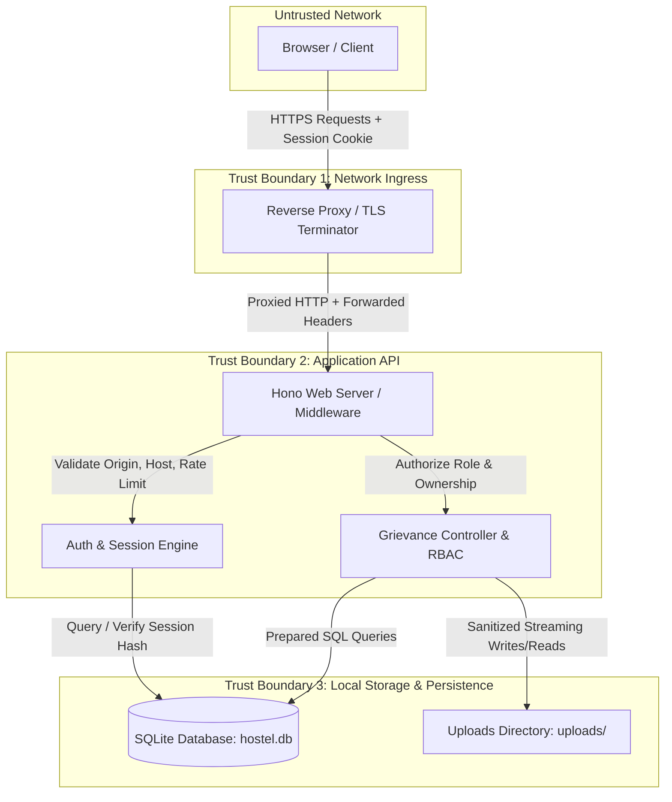

# Threat Model & Risk Assessment (THREAT-MODEL.md)

**System:** HostelGrievance University Portal  
**Methodology:** STRIDE Threat Modeling & Data Flow Analysis  
**Date:** 29 August 2026  

---

## 1. System Assets & Target Valuation

| Asset ID | Asset Name | Description & Sensitivity | Impact of Compromise |
|---|---|---|---|
| **AST-01** | Student PII & Grievance Records | Student names, room numbers, grievance titles, descriptions, and private attachments. | **High:** Privacy violation, harassment, reputational damage to institution. |
| **AST-02** | User Credentials & Session Tokens | Saluted password hashes, active session tokens in cookies/SQLite. | **Critical:** Full account takeover and identity impersonation. |
| **AST-03** | Attachment Files on Disk | Uploaded photos, documents stored in `uploads/`. | **High:** Data leak, disk exhaustion, malicious binary execution. |
| **AST-04** | Audit Trail Logs | Historical records of grievance creations and status mutations. | **Medium:** Loss of accountability, dispute resolution integrity failure. |
| **AST-05** | Service Availability (Hostel API) | The Hono + SQLite web application runtime. | **High:** Disruption of university grievance intake and hostel operations. |

---

## 2. Threat Actors & Capabilities

1. **Unauthenticated Public Attacker:** Remote attacker on the Internet or campus Wi-Fi network attempting credential stuffing, brute force, API probing, or denial-of-service.
2. **Malicious Student (Authenticated):** Legitimate student user attempting horizontal privilege escalation (IDOR) to view/alter other students' grievances, or uploading oversized files to cause storage DoS.
3. **Compromised Warden Account:** Attacker possessing warden credentials attempting unauthorized modifications or data exfiltration.
4. **Local / Co-located Host Attacker:** Rogue process or unauthorized user on the shared server host attempting to read SQLite files or attachments directly.

---

## 3. Trust Boundaries & Data Flow Diagram

### Trust Boundary Definitions:
* **TB-1 (Network Ingress):** Between external client browsers and the reverse proxy. Untrusted boundary; all incoming traffic is validated for TLS, valid Host headers, and CORS/CSRF constraints.
* **TB-2 (Application API):** Between HTTP endpoints and server-side business logic. Authentication required via `hg_session` cookie; role boundaries enforced on every endpoint.
* **TB-3 (Persistence Layer):** Between Node.js process and filesystem. Isolated with `0o600` / `0o700` POSIX modes.

---

## 4. STRIDE Threat Analysis & Mitigations

| STRIDE Category | Specific Threat | Target Component | Applied Mitigation & Control |
|---|---|---|---|
| **Spoofing (S)** | Attacker spoofs client IP in `X-Forwarded-For` to bypass rate limits. | `/api/login` | `TRUST_PROXY` validation with regex sanitization and direct peer address fallback. |
| **Spoofing (S)** | Attacker crafts forged session token or steals cookie via XSS. | `src/server/auth/session.ts` | 32-byte cryptographically secure tokens; `HttpOnly`, `SameSite: Lax`, and SHA-256 DB token hashing. |
| **Tampering (T)** | Student modifies status of their grievance to `Resolved`. | `/api/grievances/:id` | Status mutation restricted exclusively to `warden` role in database transaction. |
| **Tampering (T)** | Attacker uploads malicious script disguised as image (MIME spoofing). | `src/server/storage/attachments.ts` | Binary `validateMagicBytes()` and dimension verification (max 4K) rejecting non-image payloads. |
| **Repudiation (R)** | Warden changes ticket status or student edits grievance text and denies it. | `grievance_audit_logs` | Append-only `recordAuditLog()` captures actor ID, action, previous/new value, and ISO timestamp. |
| **Information Disclosure (I)** | Student accesses another student's grievance details or comments (IDOR). | `/api/grievances/:id` | Strict `assertCanViewGrievance()` ownership checks enforced on all read/write endpoints. |
| **Information Disclosure (I)** | Database backup leak exposes active user session tokens. | SQLite `sessions` table | Session tokens hashed with SHA-256 before storage; raw bearer tokens never stored. |
| **Information Disclosure (I)** | User enumeration via password verification latency differences. | `/api/login` | `dummyVerifyPassword()` constant-time scrypt calculation for non-existent users. |
| **Denial of Service (D)** | Memory exhaustion via large attachment downloads or rate-limit Map spam. | Node.js Runtime | Streamed chunk responses (`Readable.toWeb()`) and capacity-bounded LRU rate limiter (max 5000 entries). |
| **Denial of Service (D)** | SQLite table lock contention from heavy wildcard searches. | SQLite Database | Configured `busy_timeout = 5000ms`, paginated queries, and search query length bounds (100 chars). |
| **Elevation of Privilege (E)** | Client-side role spoofing in `localStorage` to access warden routes. | SvelteKit Frontend | Frontend state treated as UI-only; all sensitive actions verified authoritatively server-side. |

---

## 5. Critical Attack Paths & Hardened Posture

### Attack Path 1: Horizontal IDOR Exploitation
1. **Attacker Action:** Attacker logs in as Student A and requests `GET /api/grievances/GRV-0002` (belonging to Student B).
2. **Defense Response:** Server loads grievance record, calls `assertCanViewGrievance(user, row)`, verifies `user.role === 'student' && row.student_id !== user.id`, and aborts immediately with HTTP 403 Forbidden. **Attack Blocked.**

### Attack Path 2: Malicious Attachment Upload (Web Shell / XSS)
1. **Attacker Action:** Attacker uploads `malicious.php` or an HTML file with `` disguised as `photo.png`.
2. **Defense Response:** Server inspects file magic bytes via `validateMagicBytes(bytes, 'image/png')`. The initial byte sequence fails PNG signature verification (`0x89504E47`), throwing HTTP 400 Bad Request. **Attack Blocked.**

### Attack Path 3: Decompression Pixel Bomb (Browser Freezing)
1. **Attacker Action:** Attacker uploads a 400 KB PNG file with crafted dimensions of 50,000 × 50,000 pixels.
2. **Defense Response:** Server executes `validateImageDimensions(bytes, 'image/png')`, detects width > 4096px, and rejects the upload with HTTP 400 Bad Request before saving to disk. **Attack Blocked.**

---

## 6. Hacker Point-of-View (POV) Attack Matrix & Resolution Proof

The matrix below simulates how an adversarial hacker attempts to break the application and shows the exact technical resolution deployed:

| # | Hacker Attack Vector | Attacker Strategy / Objective | Target Location | Technical Defense Implemented | Hardening ID |
|---|---|---|---|---|---|
| **1** | **`X-Forwarded-For` Spoofing** | Rotate header IPs to bypass brute-force login lockouts. | [`src/server/routes/auth.ts`](file:///d:/final%20project/GIET-Learnathon-5.0-main/src/server/routes/auth.ts) | Implemented `getClientIp()` enforcing `TRUST_PROXY` validation, IP format regex sanitization, and fallback to direct peer IP. | **HG-37** |
| **2** | **Memory Exhaustion Flood** | Flood login with millions of fake emails to exhaust heap memory via uncleaned Map. | [`src/server/routes/auth.ts`](file:///d:/final%20project/GIET-Learnathon-5.0-main/src/server/routes/auth.ts) | Added `MAX_RATE_LIMIT_ENTRIES = 5000` with automated LRU pruning of expired and oldest entries. | **HG-38** |
| **3** | **Password Timing Attack** | Measure response latency differences (scrypt vs instant rejection) to enumerate valid emails. | [`src/server/auth/passwords.ts`](file:///d:/final%20project/GIET-Learnathon-5.0-main/src/server/auth/passwords.ts) | Built `dummyVerifyPassword()` executing a real scrypt hash on missing users, equalizing response timing. | **HG-39** |
| **4** | **Host Header Poisoning** | Send crafted `Host` header to cause open redirects and phishing on HTTPS redirects. | [`src/server/app.ts`](file:///d:/final%20project/GIET-Learnathon-5.0-main/src/server/app.ts) | Implemented `isAllowedHost()` middleware validating `Host` against strict `ALLOWED_HOSTS` allowlist. | **HG-40** |
| **5** | **Missing Referer/Origin CSRF** | Strip origin headers via `<meta name="referrer" content="no-referrer">` to bypass CSRF checks. | [`src/server/app.ts`](file:///d:/final%20project/GIET-Learnathon-5.0-main/src/server/app.ts) | Enforced `Sec-Fetch-Site: cross-site` blocking and strict origin verification on all state-changing endpoints. | **HG-24** |
| **6** | **Pixel Decompression Bomb** | Upload 50,000×50,000 image with valid magic bytes to freeze warden's browser tab. | [`src/server/storage/attachments.ts`](file:///d:/final%20project/GIET-Learnathon-5.0-main/src/server/storage/attachments.ts) | Built binary parser `validateImageDimensions()` rejecting any image resolution exceeding 4096×4096px. | **HG-41** |
| **7** | **Wildcard Search DB Locking** | Send concurrent heavy `%term%` searches to trigger `SQLITE_BUSY` lock contention DoS. | [`src/server/db/connection.ts`](file:///d:/final%20project/GIET-Learnathon-5.0-main/src/server/db/connection.ts) | Set SQLite `busy_timeout = 5000ms` and truncated search query strings to max 100 characters. | **HG-42** |
| **8** | **Concurrent ID Collisions** | Send simultaneous grievance filings to cause ID generator duplicate collisions (HTTP 500). | [`src/server/routes/grievances.ts`](file:///d:/final%20project/GIET-Learnathon-5.0-main/src/server/routes/grievances.ts) | Wrapped `nextGrievanceId()` and `nextAttachmentId()` inside atomic SQLite `db.transaction()` blocks. | **HG-22** |
